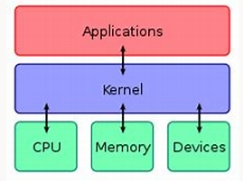

- All about Logseq [[Logseq]]
	- What is Logseq?
	  collapsed:: true
		- Logseq is a platform where we can create notes and maintain a proper knowledge base.
	- What can we do with it?
	  collapsed:: true
		-
	- How to create a link between pages [[Linking]]
	  collapsed:: true
		- create a new page
		- click on the linked page
		- enter the page which should be linked
		  collapsed:: true
			- e.g.:- creating page 1 and page 2 and clicking on page 1 and then entering page 2 on the top of the page inside square brackets.
			-
		-
-
-
- # Software Engineering  [[Software Engineering]]
	- ### What is a Software? #card
	  card-last-interval:: 4
	  card-repeats:: 1
	  card-ease-factor:: 2.6
	  card-next-schedule:: 2023-06-13T16:02:52.978Z
	  card-last-reviewed:: 2023-06-09T16:02:52.979Z
	  card-last-score:: 5
		- Software is a specific set of codes or instructions provided to the computer to complete specific tasks.
		- It's a collection of computer programs, procedures, rules and associated documentations.
	-
	- ### Types of software [[software types]]
		- software is mainly categorized into 2 parts
			- ### System Software
				- System software is designed to operate and control the computer hardware and provide a platform for running Application Software.
					- E.x. :-
			- ### Application Software
- # Operating Systems [[Operating System]]
	- ## What is an Operating System? #card
		- It's a layer of software which enables the user to interact with the computer hardware to complete specific tasks.
		- It's also a powerful and usually large program that controls and manages the hardware and software of the computer system.
		- Operating system is the program that runs at all times when the computer is active called the **kernel.**
	- # Kernel [[Kernel]]
		- ## What is the Kernel? #card
			- It is a computer program which acts as the core of any operating system and has complete control over the computer system
				- 
			- It remains in the RAM while the computer is on and it is in charge of the overall operations happening in the computer system.
		- ## Tasks of Kernel
			-
			- It manage the communication between hardware and software.
			- Allocates resources
			- Manage low level hardware interfaces(memory, I/O devices, processes)
			- security management
			- Process management
			- Memory management
			- Device drivers
			- System calls
	- # Shell
		- ## What is SHELL?
			- It is an interface provided for the user to interact with kernel.
			- Ex:- Born Shell, Born Again Shell, Korn Shell, C Shell
	-
	- ## What does the Resource Allocator do? #card
		- It manages and provides the necessary hardware resources needed by a program to be executed properly.
	- ## What does the Control Program do? #card
		- It controls the  execution of user programs and operations of I/O devices.
	- ## Functions of an Operating System #card
		- ### Process Management
			- Creates and deletes processes
			- Synchronization and communication among processes
		- ### Memory Management
			- Allocation and De-allocation of memory space to programs.
		- ### File Management
			- File organization, storage, retrieval, naming, sharing and protection of files.
		- ### Device Management
			- Keeps track of all devices (I/O Controller)
			- Allocation and De-allocation of devices
		- ### I/O Management
			- Manages I/O devices
		- ### Secondary storage Management
			- Manage all storing and accessing files and directories reading and writing operations.
		- ### Security
			- Protects the data and information against threats and unathorized access.
		- ### Command Interpretation
			- It is a program which reads the instructions given by the user and then translates these instructions into the context of the operating system followed by the execution.
		- ### Networking
			- The processors communicate with one another through the network.
		- ### Job Accounting
			- It is the process of keeping track of time and resource used by various jobs and users.
		- ### Communication Management
			- Coordination and assignment of compliers, interpreters and software resource of the various users.
	- ## Goals of an Operating System
		- Ease of use
		- Good performance
		- Allocate resources
		- control program
		- manage resources
	- ## What is Firmware?
		- It is a software program embedded to a specific hardware component providing it necessary instructions on how to execute properly.
	- ## Difference between 32 bit and 64 bit systems.
		- 32 bit systems utilizes data in 32 bit pieces which makes the CPU to do up to 2^32 processes which means it max out around 4GB of physical memory.
		- 64 bit systems utilizes data in 64 bit pieces making it able to handle way more calculations/ processes at once.
	- ## History of OS
		- The first OS was developed in 1950 to manage a tape storage.
		- General Motors Research lab implemented the first OS for IBM 701
		- in 1960 first version of UNIX OS was built.
		- first OS by Microsoft was DOS in 1981
		- Microsoft GUI was created in 1985
	- ## Different types/generations of OS #card
		- Simple Batch System
		- Multiprogramming Batch System
		- Distributed System
		- Parallel System
		- Personal Computer System
		- Real Time System
		- Handheld System
		- Time Sharing System
		- Mobile Operating System
		- Multiprocessor System
	- ## Simple Batch System
		- It is a system that processes jobs without any interactive processing
		- It gets all the jobs by the user and executes them as a batch one by one
		- In this system there are times where the CPU just idle
	- ## Job Pool
		- Jobs in the memory is always less than the jobs in the disk
	- ## Time Sharing System
		- It is an extension of multiprogramming batch system
		- The primary focus in Time Sharing System is to minimize the response time while in Multiprogramming Batch System focuses on maximizing the CPU usage
		- It is a system where it allows multiple users to use a computer system simultaneously.
		- This system uses CPU scheduling and multiprogramming to share small amount of computer power with each user.
	- ## Benefits of Time Sharing System
		- Increased efficiency
		- Cost efficiency
		- Resource utilization
		- Interactive environment