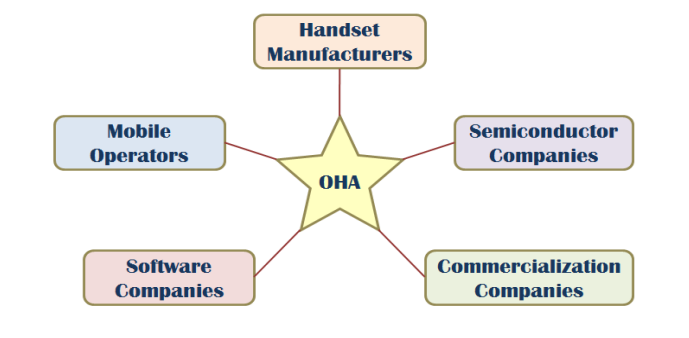

- # Mobile Operating Systems [[Mobile Operating Systems]]
	- Mobile devices have constraints and restrictions on their physical characteristics such as;
		- *Screen size
		- *Memory
		- *Processing power
		- *Battery power
	- ## History of Mobile OS
		- ### **Palm OS**
			- It's the first ever mobile operating system
			- released in 1996
			- It lacked a file system
		- ### **Windows CE**
			- Windows for **Embedded Systems**
				- **Embedded system is a combination of computer hardware and software designed for a specific function**
			- released in 1996
		- ### **Symbian OS**
			- Released for Ericson R380 in 1999
			- It was the first modern OS on a smartphone.
		- ### **BlackBerry**
			- first phone was released in 2002
			- it was meant for business purposes.
		- ### IOS
			- Released in 2007
			- it was marketed as an "Internet Communicator"
		- ### Android
			- Version 1.0 was released on HTC dream in 2008
			- it is a free and open source software developed by GOOGLE
	- # Android
		- ## What is Android? #card
		  card-last-interval:: 4
		  card-repeats:: 1
		  card-ease-factor:: 2.36
		  card-next-schedule:: 2023-06-13T13:59:57.950Z
		  card-last-reviewed:: 2023-06-09T13:59:57.950Z
		  card-last-score:: 3
			- It is a Linux based operating system designed primarily for touch screen mobile devices.
			- Google financially backed the android company and later purchased it in 2005
			- was unveiled in 2007 along with the founding of the **Open Handset Alliance**
			- first android phone was sold in October 2008
	- # Open Handset Alliance (OHA)
		- It is a business alliance consisting of 47 companies to develop open standards for mobile devices.
			- 
		- ## Android License
			- This allows the software to be freely modified and distributed.
		- ## Interface
			- The user interface is based on direct manipulation, using touch inputs that loosely correspond with real world actions
			-