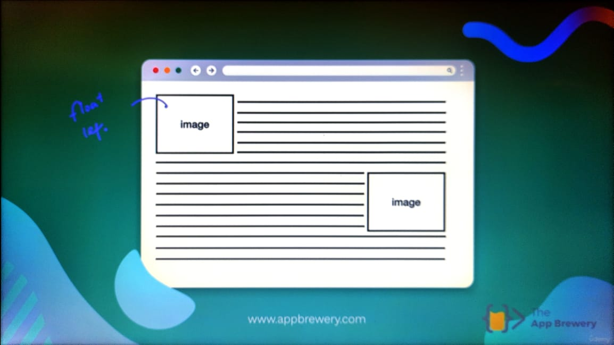
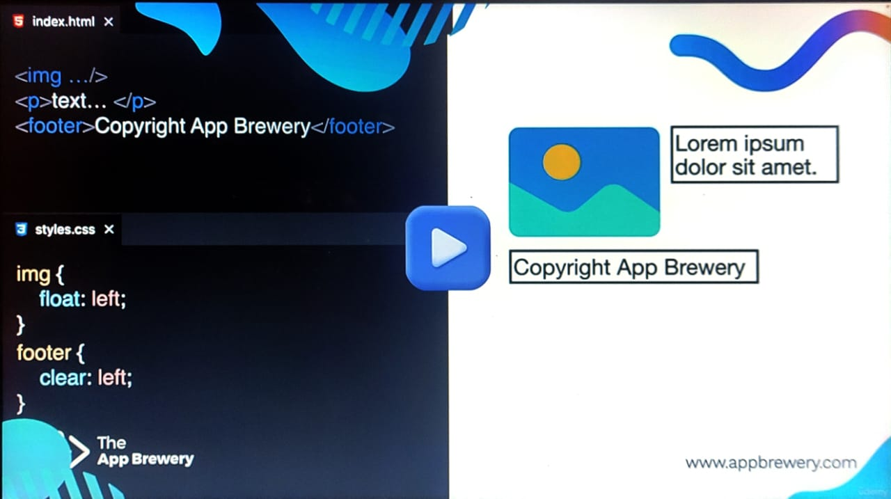
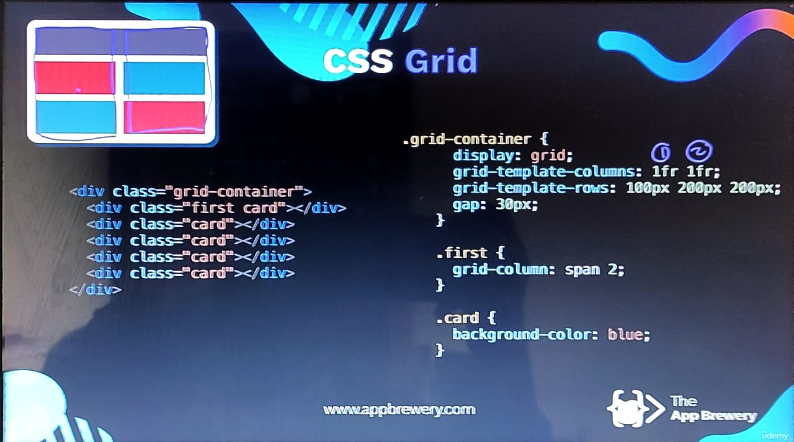
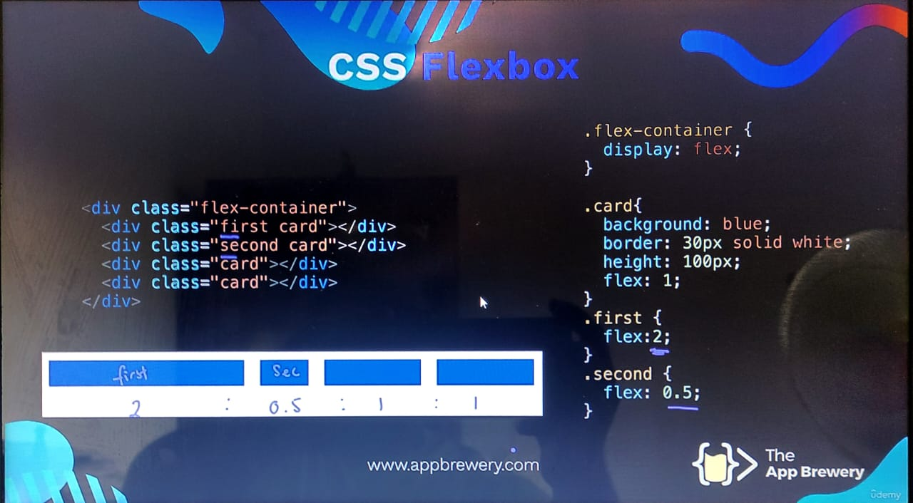
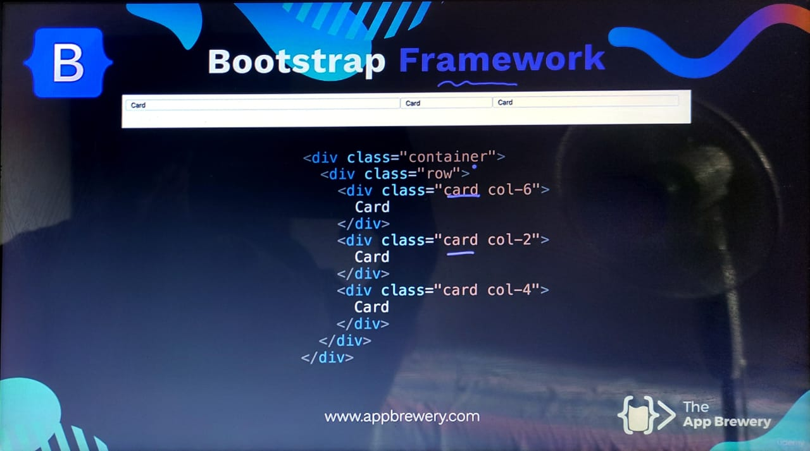

- # WordPress [[WordPress]]
	- portal 8080
	-
-
- # HTML [[HTML]]
-
- # CSS [[CSS]]
	- If the parent element position is set to relative, the child elements of that parent element will be easy to move or change position relative to the parent element.
	- Before changing the position of the child elements, the position of them should be set to absolute.
	- After that we can change the position of the child element relative to the parent element (top, bottom, left and right)
	- # Advance CSS
		- ## CSS Display
			- ### Span element
				- mostly it is placed in between of a text
				- it has different values for the display property
				- it is like the paragraph tag but this has the option to display texts which are in 2 separate paragraph tags to display in one line.
				- **Main 3 types of display**
					- ### Inline
						- Displays the context which are in 2 separate Span elements in one line
						- We can't set a height or a width for the context
						- It's set to the size of the context.
					- ### Block
						- Displays the context which are in separate Span elements in separate lines/blocks.
						- takes up entire width of the page
					- ### Inline-Block
						- **Inline** - Elements can be placed in one line
						- **Block** - Can set a width and a height for the inline elements
					- ### none
						- It'll remove the visibility of the item
		- ## CSS Float
			- It allows to wrap text around a particular element
			- 2 values of float property;
				- float: left (It'll send the image to the left and the context will start from the right side and go on)
				- float: right (It'll send the image to the right and the context will start from the left side and go on)
			- 
			- ## Clear property
				- If there is a part of context that you don't want to wrap around (eg:- footer), use the clear property and set the side that you want to clear (eg:- left, right)
					- 
				- if there are 2 images or elements with float, then set the clear property to **both**
			- Use only to wrap text around an image...
		- # Responsive Websites
			- There are 4 main ways to achieve a responsive website
			- ## 1) Media Queries [[Media Queries]]
				- It is a code that we use instead of a selector (div tag).
					- @media (max-width: 600px) {
					- /*CSS for screens below or equal to 600px wide*/
					- }
			- ## 2) CSS Grid [[CSS Grid]]
				- first we create a parent div and add some child div as we wish
				- after that in css we set the display property of the parent div to **grid**
					- 
					- **grid-template-columns** property states the number of columns that are in the grid.
					- **fr** stands for fraction which means that both column 1 and column 2 are same size. (cuz both of them are 1fr)
					- **grid-template-rows** states the number of rows that should be in the grid and the height of those rows
					- **gap** is the space between rows
			- ## 3) CSS Flexbox [[CSS Flex Box]]
				- Allows to create 1D layouts (Horizontal or Vertical)
				- It is responsive because the elements of it doesn't have a fixed width, it'll take as a percentage of the current width
				- 
					-
				- **flex** property tells the css code to have the same width on every element
				- **flex:2** twice the width of the current elements
			- ## 4) External Frameworks (Bootstrap) [[External Frameworks]]
				- It has pre defined functions/layouts
				- the web layout is divided into **12 columns**
				- this helps to determine the size of an element when the web page is resized.
				- 
				  collapsed:: true
					-
					-
				- **
 card 
** :- in this the particular div  takes half the width of the web page which it is currently displaying. because the web page is divided into 12 columns and this div takes up to 6 columns leaving 6 balance.
-
- # JavaScript [[JavaScript]]
-
	-
- # Adobe XD [[Adobe XD]]
	- ## Views in XD
		- Layers View (ctrl+y)
		- Library View / Assets View (ctrl+shift+y)
		- Plugin View (ctrl+shift+p)
		-
-
- # Figma [[Figma]]
	- There's only a limited number of pages to design in figma free version
	- Drafts tab is where we can organize our projects in the free version
	- standard grid layout 12 columns, size 75
	- standard web layout size 1920x1080 px.
	- alt + double left click enables to individually edit corners of a shape
	- shift + drag resize the image properly
	- 
	- The above image is the link option enabled which allows to adjust both the width and height simultaneously by adjusting one side.
	- select items and press shift + a it's like grouping the items.
	- shift + g hide or unhide grid
	- ## Mesh Background
		- Create a frame according to your size
		- add any type of doodle shape randomly
		- add colours to those shapes separately
		- Select all shapes and add the layer blur effect and increase the blur
		- to get the additional taste add a noise image
		- add the overlay effect on the noise image
		- and then decrease the opacity
		- ### To add the spots
			- create any shape
			- add an layer blur effect (44)
			- add a colour to the shape
			- add color dodge layer effect
		- ### Inner shadow effect
			- select a frame or any shape for the effect
			- add an inner shadow effect and pick white for that effect
			-
		-
	-