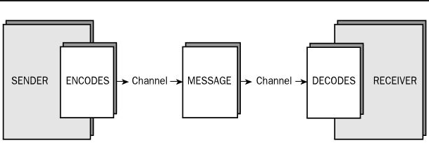
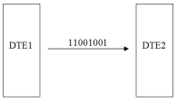
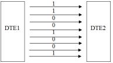

- # Computer Networks [[Computer Networks]]
	- ## What are stand alone computers? #card
		- Stand alone computers refer to any computer or device that is not connected to another computer or any network.
	- ## What is a computer network? #card
		- A computer network is a collection of interconnected  (both hardware and software) computers, printers and other resources to communicate and share resources.
	- ## What are the 2 types of networks? #card
		- Workgroup
		- Domain
	- ## What is a Workgroup? #card
		- It is a collection of computers connected on a LAN to share resources and files.
		- It is also known as **Peer-to-Peer** connection
		- In a workgroup, one computer cannot manage other computers
		- It is a Decentralized network where each computer is managed and maintained individually.
	- ## What is a Domain? #card
		- It is a system of interconnected network objects, systems and resources that are centrally managed.
		- it is also known as a **Client Server** connection
		- It is a Centralized Administration network where all computers which are connected within the network are managed and maintained all by a single machine.
	- ## Benefits of networks #card
		- provides communication
		- Sharing of files, data and information
		- Sharing of hardware/resources
		- centralize administration and support
		- Reduce the cost in communication and information gathering
		- services such as e-business, e-learning, e-banking, etc.
	- ## Components of a basic communication model #card
		- Source
		- Destination
		- Encoder
		- Decoder
		- Channel
		- 
	- ## Modes of transmission #card
		- Serial Transmission
		- Parallel Transmission
	- ## What is Serial Transmission? #card
		- It is a type of transmission where data is transmitted only one bit at a time.
		- This is method is mostly suitable for long distance transmission,
		- It is cheap but slow.
		- 
	- ## What is Parallel Transmission? #card
		- It is a type of transmission where data is transmitted byte wise (8 bits at a time) which means  it sends a series of bits at a time simultaneously using separate lines.
		- This method is suitable for short distance transmission.
		- It is expensive but fast.
		- 
	- ## Modes of Communication #card
		- Simplex
			- In this mode messages are passed only in one direction
				- eg:- TV, radio
		- Half Duplex
			- It is a two way communication mode but one should wait till the other communicates and finishes.
				- eg:- walkie talkies
		- Full Duplex / Duplex
			- It is also a two way communication mode but in this mode both or many can communicate simultaneously.
				- eg:- Phone calls, skype, video conferencing
	- ## What is a Protocol? #card
		- It is a set of rules or procedures for transmitting data between electronic devices
			- Eg:- Syntax, Error recovery methods, Synchronization of communication, Flow control
	- ## Network Models/Architecture
		-
	-