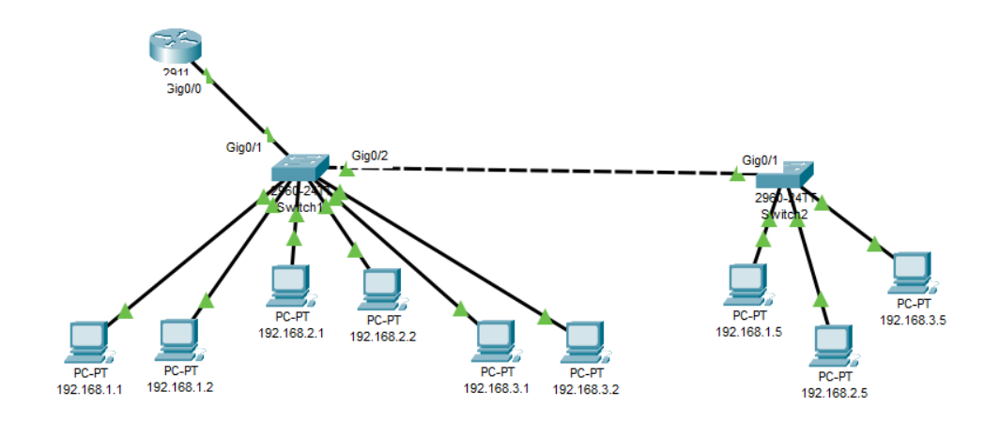

- [[CN Practical]]
	- 
		-
		- First add the specific devices from the bottom
		- after adding the computers/nodes, click on the computer icon and click on the desktop tab on the window which appears.
		- after clicking on the desktop tab click on ip configuration
		- after clicking on ip configuration add the given ip address of the specific computer and press enter to get the subnet mask
		- if you want to rename the PC, click on the config tab and set the display name
		- when connecting the computers to the switch, click on the connection icon on the bottom (thunder bolt symbol) and select the **copper straight through cable** to connect the computer and the switch.
		- after selecting that cable, click on the computer icon and select FastEthernet 0 port to set the cable and drag the cable to the switch and click on the switch and select an ethernet port to set the cable.
	- ## Configuring the Router
		- after adding the router icon, click on the icon
		- click on the CLI tab on the window which appears
		- click on the window and press **ctrl+c** and then press enter
		- after that type **en** in front of Router> and then press enter
		- if you want to go to router configuration settings type **conf t** in front of Router# and then press enter
		- if you want to go back from configuration, type **ctrl+c** and press enter
	- ## Changing Router Name
		- after going into configuration type **hostname NIBM_Router** and press enter.
	- ## Changing router status to up
		- after going to configuration in CLI, type;
			- **interface GigabitEthernet0/0.10** and press enter. this line is to choose which Gigabit ethernet port to assign to a given a network
			- **description ## VLAN 10 - IT ##** and press enter. this line is to state which network will be assigned to the Gigabit Ethernet 0.10
			- **encapsulation dot1Q 10** and press enter.
			- **ip address 192.168.1.254 255.255.255.0** and press enter. this code will set the ip address which will be used for the network 192.168.1.1, to access the internet. if the network is 192.168.2.1 then the ip address  for that network to use the internet will be 192.168.2.254
		- by giving these specific code line instructions the router will set a Gigabit Ethernet port for each specified network.
		- after specifying all the networks which are there we should type these commands to activate the router;
			- **interface GigabitEthernet0/0** and press enter. this is the router Gigabit port
			- **no shutdown** and press enter. this will activate the router.
	- ## Configuring the Switch
		- after adding the switch icon, click on the icon
		- click on the CLI tab on the window which appears
		- click on the window and press **ctrl+c** and then press enter
		- after that type **en** in front of Switch> and then press enter
		- if you want to go to router configuration settings type **conf t** in front of Switch# and then press enter
		- if you want to go back from configuration, type **ctrl+c** and press enter
	- ## Giving access to the computers to connect to the internet
		- First go to configuration in the switch
		- then type;
			- **vlan 10** and press enter. this selects the Gigabit ethernet port. in this **10** means the port number which we earlier assigned to the IT network.
			- **name IT** and press enter. this assigns the department name to the Gigabit ethernet port.
			- continue assigning all available networks to the Gigabit ethernet ports like this.
			- after assigning the networks we should assign the nodes/computers to the Fast Ethernet ports and enable access to those ports for the computers. to do that type;
				- **First we should go back to switch configuration.** after that type,
				- **interface FastEthernet0/1** and press enter. this selects the first ethernet port
				- **switchport access vlan 10** and press enter. this gives the node which is connected to the FastEthernet port 1, the access to vlan 10 network.
				- **switchport mode access** and press enter. grants access.
				- for the second node in the same network;
				- **interface FastEthernet0/2** and press enter. selects the second ethernet port
				- **switchport access vlan 10** and press enter. this assigns the second node which is in the same network to vlan 10.
				- **switchport mode access** and press enter. grants access.
				- do this to all computers.
				- after assigning all ports to computers we should establish the link between the switch and the router. to do that type;
					- **interface GigabitEthernet0/1** and press enter. selects the giga bit ethernet port 1.
					- **description ## Uplink to NIBM_Router ##** and press enter. specifies which router
					- **switchport mode trunk** and press enter.
					- **interface GigabitEthernet0/2** and press enter. selects the giga bit ethernet port 2 which is used to connect the second switch.
					- **switchport mode trunk** and press enter.
					-
			-
			-