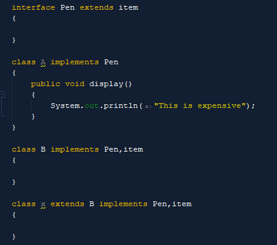

- [[Enterprise Application Development]]
	- # Starting with a project in NetBeans
		- Open netbeans
		- click on file and click on new project
		- then pick JAVA ANT and pick java application in the right side window
		- and click on next
		- select the path to save the file and give a name to the file and click on finish
	- # Things to consider when developing an APP
		- name of the main class
		-
	- # Shortcuts in NetBeans
		- To get the suggestions of codes press **ctrl + space** and type the first letter of the wanted code line
	- # Shortcuts in Intelij
		- press shift twice to enable whitespaces
		- press **alt+enter** on highlighted errors to get the suggestion to fix it
		- press **shift+F10** to run the code
		- press **shift+F09** to debug the code.
		- to add more break points press **ctrl+f08**
		- to open the project tool window press **Alt+1** and press focus
		- to get the preview are of the Find files dialog press **ctrl+shift+f**
		- to get the search
	- An abstract method is a method which doesn't have a body.
	- ## Types of Methods
		- Abstract
			- We cannot create objects from an abstract class
		- Static
			- A method which is common to all the objects in a class
		- Concrete
			- A method which already consists of a definition and cannot be overidne
		- Instance
			- It depends on the object
	- Java doesn't allow one subclass to have multiple super classes.
	- Java cannot use multiple super classes parallaly
	- we use interface to implement multiple inheritance in Java
	- identifiers are basically names
	- if no body in a method, the method will be abstract by default
	- static means fixed value
	- don't use concrete values in an interface
	- ## interface
		- Interface is used to implement multiple inheritance in java
		-
		- interfaces are used by classes
		- it is compulsory for a sub class to override an abstract method/methods of a interface class.
		- to access or override an abstract method of an interface class first the abstract method's body should be define inside the subclass and then we could access that abstract class by access the subclass.
		- an interface can be used by another interface
		- the keyword to inherit an interface class by another inherit class is **extends**
		- the keyword to inherit an interface class by another normal class is **implements**
			- eg:- class A implements B
		- to inherit multiple interface classes at once we can use the implement keyword along with the interface class's names with commas.
		- to inherit a normal class with interface classes  we can use extend along with implements keywords
			- 
				-
		-
- TODO search real world implementations of interface
-