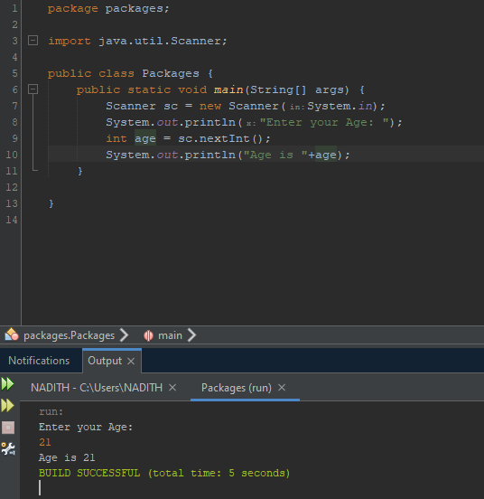
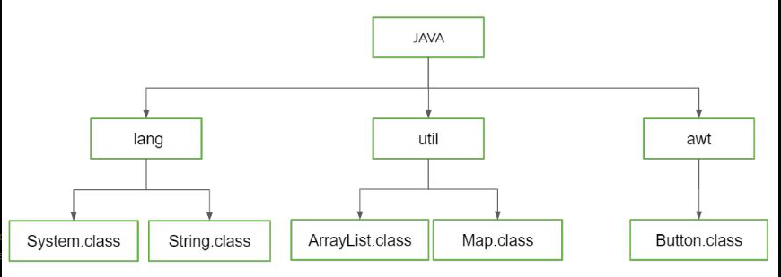

- [[Object Oriented Programming]]
- [[Enterprise Application Development]]
	- ## What is a Package?
		- **A package is a container to store classes and interfaces for future use.**
		- Packages are used as a method of organizing classes and interfaces in a java program. it is used to organize or group classes so we could avoid name conflicts and we could write a better maintainable code.
		- A package acts as a file directory which allows to prevent naming conflicts and  providing a hierarchical structure to the java code.
		- A package consists of one or more java files and also it consists;
			- ### Classes
			- ### Interfaces
			- ### Sub packages
		- There are mainly 2 types of packages;
			- ### **Built-in-packages** (Packages from the java API)
				- Built in packages are packages which are built with the programming language
				- ex:- import java.util.Scanner;
					- after using the above code and importing the Scanner class, we can create objects to use this class to get or record user inputs.
					- {:height 560, :width 536}
						- The code line **Scanner sc = new Scanner(System.in);** creates an object named sc and
				- To import all classes of a package just type **import java.[package type].*** the star symbol is used to include all the classes and interfaces of the package.
				- If you're using a new package, then we should define it.
				- 
			- ### **User defined packages** (Packages created by ourselves)
				-
		- ## Benefits in using packages
			- ### Namespace Management
				- Packages help to prevent naming conflicts by providing a hierarchical structure to the classes.
				- Different packages can have the same class name as long as they are in separate packages
			- ### Code Organization
				- Packages allow to organize the code by allowing to group classes and interfaces together which allows
		- ## How to create packages in Java
			- right click on application name
			- go to new and then click on java package
			- after giving an appropriate name for the java package (the package name should be in lower case), the package will appear in the left side with a grey box icon.
			- after the package is appeared, click on the package once and then right click on it
			- go to new and then click on java class
			- give an appropriate name for the class (name should be in sentence case)
			- there should be at least one public class in a package.
			- the first public class name should be as same as the file name for that package.
			- We can add any number of non-public classes without any error
			- We cannot add other public classes to the same file.
		- ## How to add multiple public classes to the same package
			- To add more public classes we should create separate files for those specific public classes.
			- To create separate files or classes,
				- Right click on the certain package and click
		- ## Why a class is public in a package?
		- ## How to import a static method in a package
			- type **import static [package name].[class name].[method name]**
			- the above code enables us to import a static method to a class
		- ## Types of errors
			- ### Compile time errors
				-
			- ### Runtime errors
				- Due to human issues
				- Hardware or device issues
		- ## What is an exception?
			- Exception is an event which happens during the compilation or  execution of a program which interrupts the normal flow of the instruction.
			- Exception is an unexpected situation
			- Exceptions is an object which is created by a class to disrupt the normal execution flow of a program.
		- ## Why exceptions are generated?
			- Exceptions are created due to **run time errors**
			- Run time errors can occur due to various reasons such as;
				- invalid user inputs
				- out-of-memory conditions
				- divide by 0 errors
				- unable to find file
				- network errors
				- device failure
				- code errors
				- physical limitations
			- When an exception occurs, the program creates an object called the **exception object** which contains all the information about the exception such as;
				- its name
				- description
				- state of the program when it occured
			- This allows the programmer to have a better understanding of the errors which were generated during the execution of a program.
		- ## Why exceptions should be handled?
			- ### Maintain normal flow:
				- Instead of terminating the program, exceptions can be caught and handled which allows the program to continue executing.
			- ### Prevent program crashes
				- We can prevent the program from crashing
		- A parameterized value which catches the error thrown out of the try block
		  :LOGBOOK:
		  CLOCK: [2023-07-20 Thu 14:19:02]--[2023-07-20 Thu 14:19:03] =>  00:00:01
		  :END:
		- To do any tasks which should be done even though there are exception, we use the **finally** block.
		- The tasks in the final block are tasks that should be done definitely at the end of the program.
		- TODO Prepare a table. first column runtime errors, second column exception class
		- TODO Difference between exception and errors
		- TODO what is check exception and unchecked exception
		- super class of exception which is **Exception** it'll catch all exceptions.
		- the reason we won't use the super class exception always is because we can't display a customized message to the user about the error