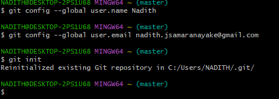

## What is Git?
	- it is an open source distributed version control system.
	- It is used to co-ordinate the work among the developers
	- created by Linus Torvalds
	- creator of Linux, in 2005
		- came out of Linux development community
		- Designed to do version control on Linux Kernel
- ## Commands in Git Bash
	- 
	- git checkout
	- git merge
	- show the working directory: **pwd** (primary working directory)
	- show files which are in the working directory: **ls**
	- go back from the current location: **cd ..**
	- to see detailed information on the files which are in the working directory: **ls -l** and **ls -al**
	- to clear the workspace: **clear**
	- to create a directory: **mkdir (directory name)**
	- to check all the files with similar names to the name you provided in the current location: **type the name and press on tab twice**
	- After moving to the directory location where we want to commit and push, we should initialize the directory which will allow the version controlling system to monitor the files. to do that type: **git init**
	- to create a file in a directory: **touch (file name with extension)**
	- to check the status of the repository: **git status**
	- ### If the directory is initialized you will see the word master
	-
- https://chat.openai.com/c/6468df46-3dee-4186-ad79-0e41c3a6bbf8
-