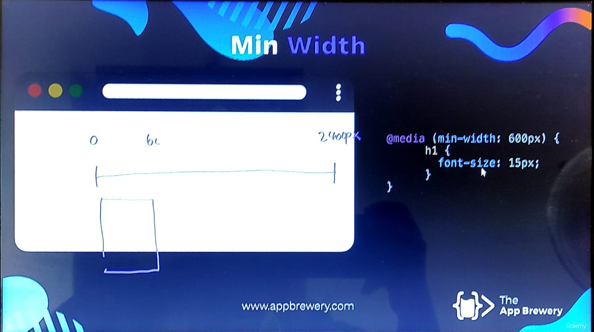

- # Max Width
- It is targeted for smaller displays
- 
- if the display that the webpage is currently displaying had a width equal or less than 600px, the font size of the h1 tag will be set to 15px
-
- # Min Width
- It is targeted for larger displays
- 
	- It targets the displays which has a width of more than 600px
- # Combining both
- 
	- In this case it'll target displays which has a width between 600px and 900px
- {:height 445, :width 780}
	- This will target displays which aren't between 600px and 900px
	-