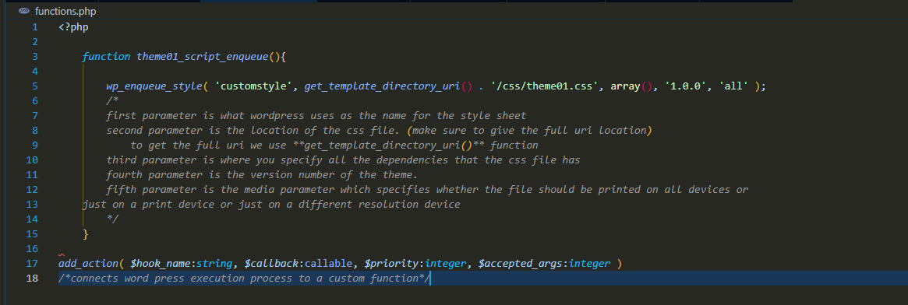
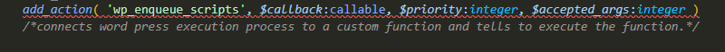
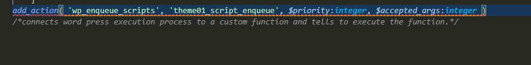

- 1) Create a database with an appropriate name
- 2) Create a folder in xampp/htdocs folder and then copy the extracted wordpress files in that folder.
- 3) Install wordpress by opening the file using localhost (localhost:8080/(folder name)/wp-admin)
- 4) Go to the file location where you installed wordpress.
- 5) Open wp-content folder
- 6) Open themes folder and then create a folder inside the themes folder by giving an appropriate name.
	- The folder you created will be your theme.
- 7) After creating the folder, create a style.css file and then open that file in a text editor and comment the theme details such as;
	- Theme Name
	- Theme URI (Uniform Resource Identifier is like link)
	- Author
	- Description
- 8) After that create a index.php file and then create header.php and footer.php files
- By default, wordpress won't display the contents of the header and the footer files. to display the content of the header and the footer files you should tell the index.php file to include those files. to do that you should add these code lines in the index.php file
	- To add the footer we should add this code line in the beginning of the file.
		- **<?php get_header();?>** (you can use the file name that you have given to your header file. (get_(fileName))
	- To add the footer we should add this code line after including all the context that needed to be entered. this should be added at the bottom of the file.
		- **<?php get_footer();?>** (<?php get_(footer file name);?>)
- ## Default files to create at the beginning
	- style.css
	- index.php
	- header.php
	- footer.php
- To add the styling we should create a separate file to include the styles. in my case I've created a folder name css and then I have created a css file with the theme name. you could use any name you want.
- To add the JavaScript functions, I have done the same thing.
- By default wordpress don't include the styles to your theme. we should instruct wordpress to include the style file to our theme.
- to do that we should create the **functions.php** file.
	- **Don't change the name of the file**
- ### Always use unique names for your functions
- # functions.php
	- This file is used to to tell WordPress to connect the custom styling files to the theme.
	- 
	- This function is used to specifically enqueue the styles for your WordPress theme.
		- **Enqueue** refers to the system used to manage and add styles to a web page in a proper order.
		- Enqueue is important because later on when we are adding external plugins to the theme, those plugins might want to add their own scripts. if those styles were added in a messy way, there might be conflicts in the scripts. scripts might run before their dependencies or styles might override each other in an unpredictable way.
		- The Enqueue system ensures that everything is loaded in a right order and only once.
	- 
		- This action is used to call the function to execute.
			- The 'wp_enqueue_scripts' is what tell wordpress to include all the scripts to the theme.
			- Because it is an action, we code it between single quotes and represent it as a string.
	- 
		- The second parameter is the name of the function that the action should execute.
		- This also should be in single quotes.
	- The last 2 parameters aren't needed. we can just erase them.
	- Even though all the php syntaxes are correct, we should specify WordPress to print all the styles.
	- To do that we should use a premade function inside the header of the header.php file.
	- **<?php wp_head(); ?>**
		- This function connects all the WordPress hooks and functions.
	-