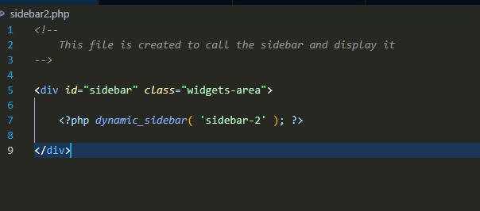
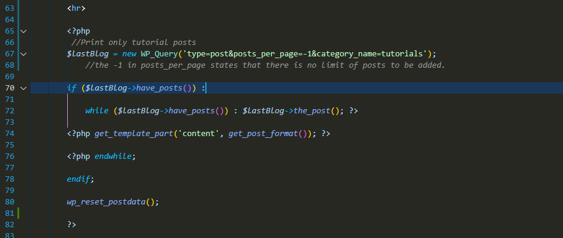
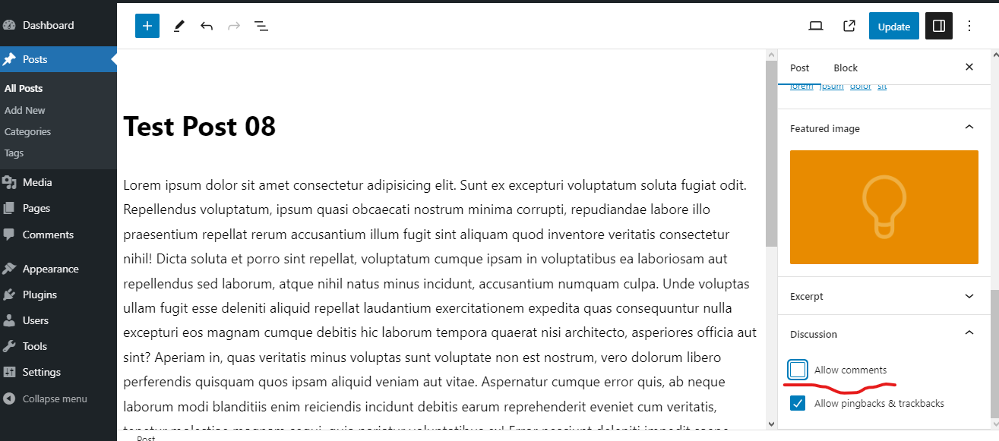

# Lesson 01: Getting started with WP theme development
	- 1) Create a database with an appropriate name
	- 2) Create a folder in xampp/htdocs folder and then copy the extracted wordpress files in that folder.
	- 3) Install wordpress by opening the file using localhost (localhost:8080/(folder name)/wp-admin)
	- 4) Go to the file location where you installed wordpress.
	- 5) Open wp-content folder
	- 6) Open themes folder and then create a folder inside the themes folder by giving an appropriate name.
		- The folder you created will be your theme.
	- 7) After creating the folder, create a style.css file and then open that file in a text editor and comment the theme details such as;
		- Theme Name
		- Theme URI (Uniform Resource Identifier is like link)
		- Author
		- Description
	- 8) After that create a index.php file and then create header.php and footer.php files
	- By default, wordpress won't display the contents of the header and the footer files. to display the content of the header and the footer files you should tell the index.php file to include those files. to do that you should add these code lines in the index.php file
		- To add the footer we should add this code line in the beginning of the file.
			- **<?php get_header();?>** (you can use the file name that you have given to your header file. (get_(fileName))
		- To add the footer we should add this code line after including all the context that needed to be entered. this should be added at the bottom of the file.
			- **<?php get_footer();?>** (<?php get_(footer file name);?>)
	- ## Default files to create at the beginning
		- style.css
		- index.php
		- header.php
		- footer.php
	- To add the styling we should create a separate file to include the styles. in my case I've created a folder named css and then I have created a css file with the theme name. you could use any name you want.
	- To add the JavaScript functions, I have done the same thing.
	- By default wordpress don't include the styles to your theme. we should instruct wordpress to include the style file to our theme.
	- to do that we should create the **functions.php** file.
		- **Don't change the name of the file**
	- ### Always use unique names for your functions
- # Lesson 02: Connecting stylesheets and scripts
	- ## functions.php
		- This file is used to to tell WordPress to connect the custom styling files to the theme.
		- 
		- This function is used to specifically enqueue the styles for your WordPress theme.
			- **Enqueue** refers to the system used to manage and add styles to a web page in a proper order.
			- Enqueue is important because later on when we are adding external plugins to the theme, those plugins might want to add their own scripts. if those styles were added in a messy way, there might be conflicts in the scripts. scripts might run before their dependencies or styles might override each other in an unpredictable way.
			- The Enqueue system ensures that everything is loaded in a right order and only once.
		- 
			- This action is used to call the function to execute.
				- The 'wp_enqueue_scripts' is what tell wordpress to include all the scripts to the theme.
				- Because it is an action, we code it between single quotes and represent it as a string.
		- 
			- The second parameter is the name of the function that the action should execute.
			- This also should be in single quotes.
		- The last 2 parameters aren't needed. we can just erase them.
		- Even though all the php syntaxes are correct, we should specify WordPress to print all the styles.
		- To do that we should use a premade function inside the header of the header.php file.
		- **<?php wp_head(); ?>**
			- This function connects all the WordPress hooks and functions.
		- After embedding the style sheets, we should embed the JavaScript files as well. to do that we should use a function in the footer section.
		- 
		- As we did to include the stylesheets, we should give instructions on which js files should be included and where the js scripts should be included. in this case we have added in the footer.
		- After doing this we should open the footer.php and add the code line;
			- **<?php wp_footer(); ?>**
				- This code line will include and execute the functions that are necessary to run the js scripts.
- # Lesson 03: Creating a custom menu and displaying specific pages on specific sections
	- First we should go to the pages section in the WordPress dashboard and create some pages.
	- By default when we click on appearance there is a sub  menu called **Menu** to add and customize our menues.
	- In our case it is not yet added to our theme.
	- 
		- If we want to activate a specific theme support when we are creating a theme, it's better to include this hook in a function.
		- 
			- In here we could state to execute the function after initialization. which is recommended in most cases.
			- 
			- We use the **init** method because later on we're going to add more functions and more hooks.
			- To execute after the initialization first we should include **'init'** instead of **'after_setup_theme'**.
	- After following these steps, if we reload the wp dashboard, we could see the menu sub menu under appearances.
	- Now, create the menu with the necessary navigation links
	- After that all we have to do is display the navigation menu in the header.
	- To do that we have to add this code line in the header.php file which will instruct wordpress to display the menu that we created.
	- 
	- To display a specific menu, we have to provide the theme location in the parameters. it is done as follows;
		- 
		- The theme location, in this case it's **primary** should be the exact name that we have given in the functions.php file.
		- 
	- we could create multiple navigations by duplicating the **register_nav_menu** code line.
		- 
		- In here we have created another menu called **secondary** and as the description we have stated it as the footer navigation.
		- To display this navigation on our theme we should instruct wordpress to display the menu as we did with the primary menu.
		- To do that we should include this code line in the footer.php file because this menu was intended to be displayed in the footer.
			- 
		- Now, all we have to is to go to the wp dashboard, under menus, create a new menu and select the footer navigation and select the pages that you intend to display in that menu and save it.
- # Lesson 04: Using Post Loop and custom body class
	- We are done with the header navigation and the footer navigation. now we have to do is include content to our body section.
	- The content in the body section is included in the index.php file.
	- Before adding posts to the body section, we should create the posts using the wp dashboard  Posts tab. after creating posts, we should include the below code to the index.php file because it is the file that is used to display the content of our theme.
		- 
		- There are 2 loops in this code, the first loop which is an if condition will check the availability of posts and the second loop which is a while loop prints the posts until there are no posts left to print.
		- The **<?php the_title(); ?>** which is a pre-built function identifies the title of the post and then prints it. same goes for the content tag.
		- We have used styles to style the title and the paragraph by closing the php tags and opening them in necessary places.
	- Even though we have added the codes to add the posts to our theme, if we navigate through our menu section and come back to the home page you would see that the posts would be gone. that's because WordPress default setting is to display the latest posts in our home page. to change this;
		- Click on settings
		- Click on Reading
		- Under your homepage displays, click  A static page
		- Under Homepage select the page that you want as the home page.
		- Create a separate page to include your blog posts and then navigate to the same location and select the page name where you want your posts to be displayed under Posts page.
		- After that go to Menus under appearance and add the blog page that you created to the menu structure.
		- Now you could see the posts that you created under the blog tab
	- If we inspect elements and navigate through our navigation menu, you could see that nothing changes in the elements because it won't identify the changes. because of this it will be hard to add changes to the theme using separate plugins or in a different theme editor. to prevent that;
		- Open the header.php file and add the below code inside the body tag.
		- 
		- now if you inspect elements, WordPress will be able to identify the changes of the classes that you're navigating to.
	- If you want to print a custom class in the body, you should do as follow by adding an array inside the php body_class and specifying which class you want to add;
		- 
	- The above method will print the given class in every page. to print a specific class in a specific page we should first instruct WordPress to identify the current page where the user is. to do that;
		- 
		- this code lines will check whether you are in the home page or not.
		- If we click on the home page tab and inspect elements, you would see that the class will be **no-awesome-class**.
		- This is because WordPress, by default it will consider the page which consists the blogs as the home page.
		- To check whether we are in the front page we could use the **is_front_page()** function instead of the **is_home()** function.
			- 
- # Lesson 05: Creating custom & specialized Page Templates
	- To create a page derived from the normal styling, you should create a separate php file and then edit it as you need.
	- Always remember to add the **get_header** and **get_footer** functions when creating a new php file for a new page.
	- But with this method we can't predict the names and create new pages each and every time when a user want to create a page. because of that reason we create a page template.
	- To inform WordPress that the specific php file is a page template, we should add the template name inside the php tag as follows;
		- 
		- To select the template we could navigate to the WordPress dashboard, under pages select the page you want and then you could see a tab to select the page template.
		- By default WordPress have selected the default template which is the index.php file.
	- If the user decides to change the premalink of a page, the user cannot see view the page again because the new name is not the existing name of the php file. rather than changing the php file name we could assign the page id as the page name which never changes. this will prevent this issue.
		- To get the id of the page, go to the administration panel (Wp Dashboard), click on the page you want and then click on the URL and see the variable assigned to POST. that is the id of the page.
		- 
		- After that change the php file name to **page-8**.
			- 
	-
- # Lesson 06: Adding theme features with add_theme_support
	- Theme support is important built-in functionality which is used add many features to the theme.
	- If we are using  a separate php file for functions we don't need to add the add_theme_support hook inside a function. it can be added outside the functions. but if we are using this hook in plugin development, we should add this hook inside a function and then call it using add action.
	- 
	- If we use the **custom-header** and add a header image to the website, it won't be displayed. to prevent this we should instruct WordPress to display it. other styles will be displayed because WordPress will generate the inline styles for those styles but for the header image it can't generate because it's a bit complex. therefore we should provide the code.
	- 
	- Add the above code line in the header.php file because we want this image to be displayed in the header.
	- To get detailed information of a hook, type **var_dump(hook name)** inside a php tag. this will display all the information that hook stores.
		- 
	- ## post_thumbnails
		- 
		- To display the image we should include the necessary code lines in the index.php file.
			- 
			- We could use **large** for the post_thumbnail which will make the image large.
- ### **Visit the Codex page in WordPress to get detailed information on all attributes of hooks.**
	- https://developer.wordpress.org/reference/functions/add_theme_support/
- # Lesson 07: Adding & creating post formats.
	- There are 9 methods to format a post in a website. they are;
		- **aside**
		- **gallery**
		- **link**
		- **image**
		- **quote**
		- **status**
		- **video**
		- **audio**
		- **chat**
	- 
	- To see the current format of the post,
		- 
	- We could use post formats to include different files to our post based on the post format. to do that , we could use the **get_template_part()** function.
		- 
		- I have removed the code lines which were used to display the content of page and added those code lines in file called content.php and called that file inside the **get_template_part()** function. this is how this function is used to add seperate files to our page.
		- 
		- In here I have instructed to display the posts based on their formats. In the WordPress dashboard we can select the order of the post which should be displayed. according to that and the file names I have given, it will select the necessary post to display. in here it will first search for the file name 'content' and then search for the post format name. I have created files with the post format names. we could use any name instead of content. (post-image, post-aside)
			- content-aside
			- content-image
- # Live Session: Adding bootstrap
	- WordPress also has pre-built jquery scripts. we could add them using **wp_enqueue_style('jquery');** inside the script enqueue function in functions.php file.
		- 
	- By default WordPress includes the jquery file in the header. in some cases this is good and in some it's not.
	- If we include the jquery in the header, the loading speed of the website will be slower.
	- Unfortunately we can't assign where the jquery to be loaded unlike when including style sheets.
	- Another way to make the title clickable,
		- 
		- This method is mainly used because it provides more security.
		- 
			- The esc_url code is used because hackers could inject to the permalink and gain access to our database, to prevent that we use the **esc_url()** code line and include the get_permalink() code as a parameter in it.
		- In here the we don't directly add the get_permalink code inside the a href="" code line because it's not secure. instead of that method we have used **%s** to represent the esc_url(get_permalink()) code.
		- In php when we add a comma next to the first parameter in the sprintf, it'll consider what's type after the comma as the values in the first parameter.
		- 
			- This is the normal that can be used to link the title of the post
- # Lesson 08: Creating sidebars & widgets areas
	- When adding a new sidebar we should register it first.
	- To do that we should include the below code lines in the functions.php file
		- 
		- The last 4 parameters are really important because it allows to fully customize the markup of a single widget that you activated in the front-end and it is necessary to specify the mark-up that will be created around a single widget.
		- The aside id and class in the before_widget are connected to the id and class parameters in the array.
		- After creating the function we should call the function using the **add_action** hook.
			- {:height 424, :width 687}
	- After creating the function and calling the function, we should instruct WordPress to display the sidebar. to do that we should create a separate php file (sidebar.php)
		- 
	- After that we should call it in the place that you want it to be displayed.
		- 
	- If you create multiple sidebars and if you want to assign them to separate pages, you'll have to register the sidebar first in the functions.php file.
		- 
	- After that create a seperate php file to call the sidebar.
		- 
	- And when you want to assign the specific sidebar you could use a if condition to identify the page id and then display the specific sidebar that you need for that page.
		- 
	- or we could create a separate php file for the specific page with their respective page id and give the code to display the necessary sidebar.
		- 
	- If there is only one sidebar we could use the code **<?php get_sidebar(); ?>**. but in here there is more than one sidebar, therefore we need to choose the sidebar. that's why we are using the **dynamic_sidebar('(sidebarID)');** code to print the sidebar.
- # Lesson 09: Editing the query_posts with WP_Query.
	- The query posts is a really important functionality in WordPress.
	- It is the query that handles the generation of the core content of a WordPress installation.
	- The query_posts code isn't needed to be called because it is called by itself in WordPress. we use this code because we could generate the content whenever and wherever we want.
	- **WP Query** and the **Get Post** functions are the methods that WordPress provides us to handle the query post without destroying it.
	- ## Adding the latest post to the home page.
		- To do this we create a separate php file as the post page of the home page.
		- 
		- In here we have created a variable ($lastBlog) to assign the latest post.
		- We have provided the type what we want to retrieved and how many that we need to be retrieved as parameters in the WP_Query method. by default WordPress will fetch the latest post and in here we have asked only one post to be retrieved.
		- Because we are dealing with a sensitive method we have to include the **wp_reset_postdata();** function to make sure that no issues will occur in the long run.
		- After retrieving the latest post we have to display the available content of the home page. to do that,
			- 
			- Add these code lines after.
	- ## Adding 2 other posts which are after the latest post.
		- As we know WordPress loads the posts in a descending order. where the latest post will be fetched first.
		- In here we have already set to display the latest post and we want to skip that and print other 2 posts.
		- 
		- the **&offset=1** parameter in the WP_Query function instructs WordPress to skip one post and retrieve the other post.
		- In here because we have setted the **&posts_per_page=1** WordPress will retrieve only one post.
	- ## Adding a post of a specific category.
		- To identify the category of the post we should get the category ID of the certain post.
		- To do that go the WP dashboard, under posts click on category after that click on the category you want. click on the URI and then you'll see the tag_id which is the category ID.
		- 
		- We use the id, in case if the category name change.
		- To use the category name and search we could use this method,
			- 
			- we could use the category_name parameter to identify the posts by their category name.
	- When using the WP_Query method, we have to enter numerous parameters to fit our needs. the way that I have used to add the parameters will be messy if there is a lot of parameters to be included. to avoid that we could use an array to assign the parameters and add the array name as the parameter.
		- 
- # Lesson 10: Filtering WP_Query with categories.
	- 
		- In here we have edited the home page so that it will display 3 latest posts according to their posted time.
		- The posts are displayed in the format that we created in the content-featured.php file.
			- 
		- To display posts that are in a specific category,
			- 
			- This will display 3 posts from the categories you have picked.
			- 10,11,9 are the category ID's. to get that click on the category in the WP dashboard categories section and then click on the URI and check for the tag_ID.
	- If a post has multiple categories and we want to pick posts that are in one specific category,
		- 
		- For an example if want only the posts that under the news category and if there are posts that belong to the news and reviews category, we could just simply add the reviews category ID in the array and it will filter those posts out.
	- To display the latest post in different categories,
		- 
		- 
- # Live Session 02
	- ## Adding a carousel
		- Get the code for your desired carousel from the bootstrap site.
		  collapsed:: true
			- https://getbootstrap.com/docs/5.3/components/carousel/#how-it-works
		- 
		- 
		- 
		- 
		- 
		- 
	- ## Arranging the blog posts.
		- 
		- 
- # Lesson 11: The single.php file, tags, edit links & comment template.
	- In the layout that we created to display the blog posts, we can't click on the post and view the content of the post. we use the single.php file to achieve this task.
	- This is happening because by default WordPress selects the latest content type that we have added in our index.php file.
	- The single.php file won't harm the other functions and content of the webpage. it will be called only when we click on a blog post to view its content.
	- 
	- The single.php file behaves like the content.php file. which means we can create separate files based on the content type.
	- ## Adding a comment section.
		- The comment template is a built in functionality which calls the actual comments.
		- 
		- To enable comments, click on the specific post you want and in the right side under post, scroll down till you see the discussion section. click on that and then you'll see a checkbox to enable comments.
			- 
		- To edit the comment options and settings for a post click on the settings option in the WP dashboard and click on the discussion sub menu. there you'll find all settings related to enabling comments for a post.
- # Lesson 11: Creating a custom search form and managing the search results page.
	-